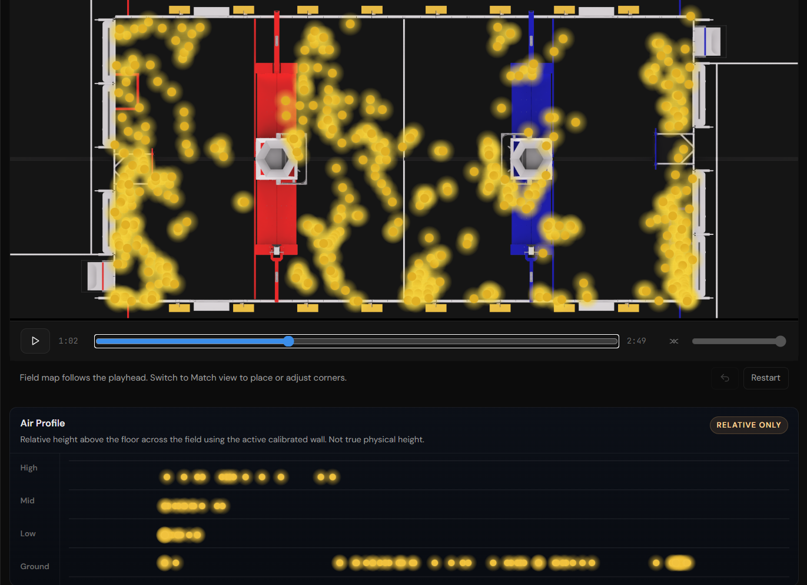

# fuel-density-map



Local SPA for importing a YouTube match clip, drawing the field region to analyze, generating a fuel-density overlay, and reviewing saved sessions on your machine.

## Requirements

- [Bun](https://bun.sh/)
- Python 3.14+
- Python packages from `requirements.txt`

## Install

```powershell
python -m pip install -r requirements.txt
bun install
cd webui
bun install
cd ..
```

## CUDA OpenCV Build

For the GPU pipeline, build a repo-local CUDA-enabled Python runtime and let the Bun API pick it up automatically:

```powershell
bun run build:opencv-cuda
```

That creates `.venv-opencv-cuda/` and installs a custom `cv2` there. If it exists, the API uses that interpreter automatically; otherwise it falls back to your normal `python`.

If you are setting this up on a fresh machine and the local build env or `third_party/opencv*` sources do not exist yet, run:

```powershell
python scripts/build_opencv_cuda.py --bootstrap
```

Notes:

- The script expects CUDA at `/usr/local/cuda`
- It builds OpenCV `4.12.0` from the official `opencv` and `opencv_contrib` repos under `third_party/`
- The processing pipeline uses the `ffmpeg`/`ffprobe` binaries for video ingest, so the custom CUDA OpenCV build can stay small and focused on image processing modules

## Run in Development

```powershell
bun run dev
```

That starts:

- the Bun API on `http://localhost:3001`
- the Vite SPA on `http://localhost:5173`

## Build for Local Use

```powershell
bun run build
bun run start
```

`bun run start` serves the built SPA and the API from one local server.

## Storage

- Sessions are stored on disk under `sessions/`
- Each session keeps its downloaded video, generated overlay PNGs, raw data, and session metadata locally

## Notes

- The YouTube import flow uses `yt-dlp` through Python, installed from `requirements.txt`
- The processing pipeline still uses OpenCV, NumPy, and Pillow
- `processor_cli.py` now supports `--backend cpu|cuda`, `--overlay-output video|frames`, `--working-scale`, `--detector-budget`, `--max-active-tracks`, and `--detector-mode legacy|peak|hybrid`
- `benchmark_processor.py` can benchmark the processor against a local clip and print per-stage timings from `stats.json`
